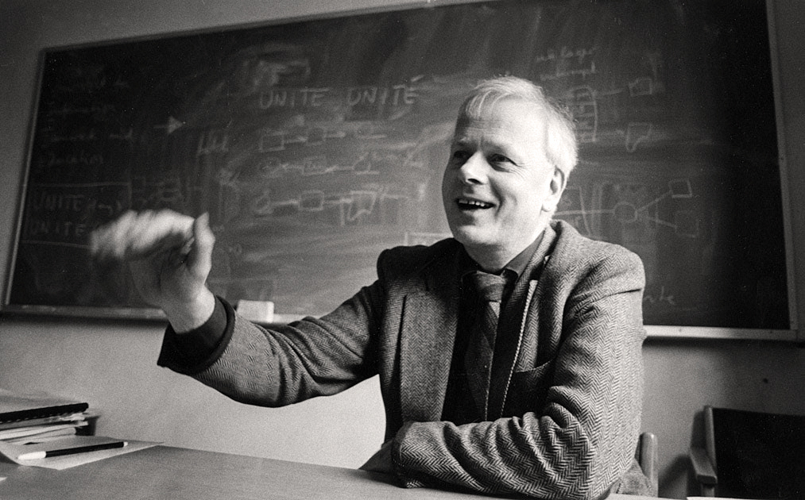
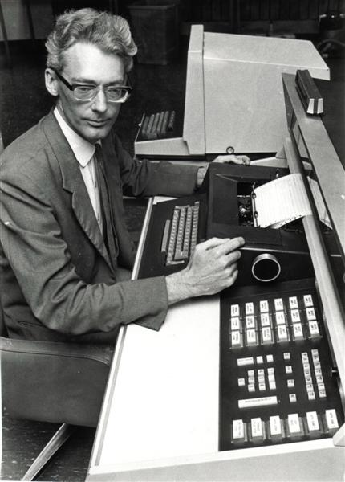

---?image=assets/bg2.jpg&size=100% auto

### Simula  

*Gabrielle Aguilar & Jason Bacani*

---?image=assets/bg2.jpg&size=100% auto

## SIMULA I

+++

### Kristen Nygaard

+++ 

### Kristen Nygaard

- Norwegian computer scientist |
- Born on August 27, 1926 Oslo, Norway |
- University of Oslo (MS in Mathematics) |
- Acknowledged as co-inventor of Object-Oriented Programming |

+++

### Problem

- 1950s: Describing how a system works was usually done using flow diagrams and a list of rules. |
- 1957: Nygaard wanted a better way of doing this. |
- Nygaard saw the potential with computer-aided simulations |
- He wanted to standardize the procedures of simulating a system using a computer language. |
- However, he needed someone more skilled in programming.. |

+++

### Ole-Johan Dahl

+++

### Ole-Johan Dahl

- Norwegian computer scientist |
- Born on October 12, 1931 Mandal, Norway |
- University of Oslo (MS in Numerical Mathematics) |
- Acknowledged as co-inventor of Object-Oriented Programming |

+++

### Birth of SIMULA I

- Nygaard and Dahl met at the Norwegian Defense Research Establishment (NDRE) |
- January 1962: Dahl joined Nygaard in developing this computer language |
- May 1962: SIMULA I was born, a simulation language |

+++

### SIMULA I

- Simulation language |
- Used to program simulations on a computer |
- Not a general-purpose programming language |

+++?image=assets/dahl-nygaard2.jpg&size=100% auto

---?image=assets/bg2.jpg&size=100% auto

## SIMULA 67

+++

### Transition to Generality

- Dahl and Nygaard realized they could make a general-purpose language from Simula I

> We can not just produce new special purpose languages the whole time, because they will not be widely implemented.  - Kristen Nygaard

+++

- Also, Dahl and Nygaard were influenced by the movement toward general-purpose languages at that time.
(ALGOL, PL/I)

> we have spent so much time with all these people working on general purpose languages, that I must admit we have to some extent fallen in love with the concept.. - Kristen Nygaard

+++

### Ideas for Generality

- 1963: Dahl and Nygaard started to come up with ways to implement generality

- 1966: Concept of an object and a class were introduced by the two

- 1967: Paper about these novel concepts was presented at the IFIP(Intl. Fed. for Information Processing) conference in Oslo. This was considered the first formal declaration of SIMULA 67.

+++

### SIMULA 67

- First object-oriented language(classes, subcluasses, methods, instances)
- General-purpose 
- Near complete superset of ALGOL-60

+++

---?image=assets/bg2.jpg&size=100% auto

## Simula Tutorial

+++

### Value Types
- Integer
- Short Integer
- Real
- Long Real
- Boolean
- Character

+++

### Reference Types
- Object Reference
  - Ref(Object Identifier)
- Text
 - "Simula"

+++

### Simple Statements
- Assignment
 - x := 1
- Reference Assignment
 - x :- New ClassName
- Procedure
- Goto

### Structured/Compound Statements
- Blocks
 - Begin ... End;
- Conditional Statements
 - If ... Then ... ; If ... Then ... Else ... ;
 - Switch
- Loops
  - While ... do ... ;
  - For
