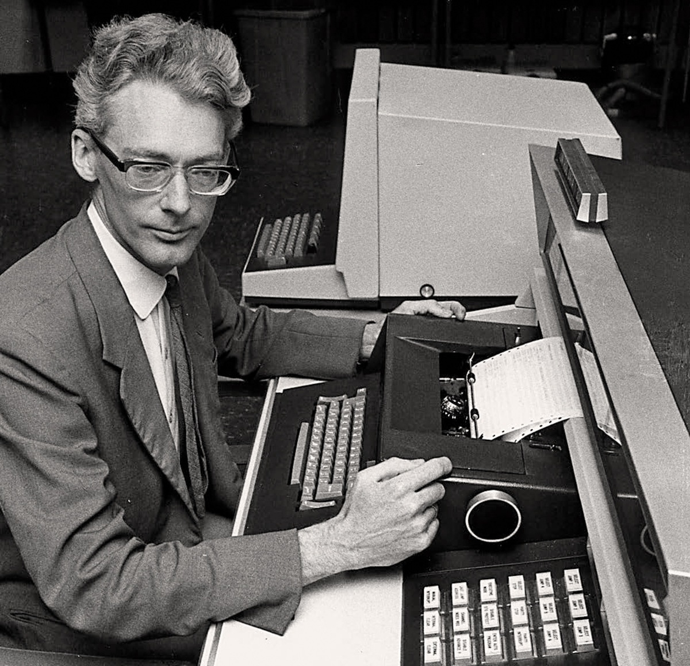

---?image=assets/bg2.jpg&size=100% auto

### Simula  

*Gabrielle Aguilar & Jason Bacani*

---?image=assets/bg2.jpg&size=100% auto

## SIMULA I

+++

### Kristen Nygaard


+++

### Kristen Nygaard

- Norwegian computer scientist |
- Born on August 27, 1926 Oslo, Norway |
- University of Oslo (MS in Mathematics) |
- Acknowledged as co-inventor of Object-Oriented Programming |

+++

### Problem

- 1950s: Describing how a system works was usually done using flow diagrams and a list of rules. |
- 1957: Nygaard wanted a better way of doing this. |
- Nygaard saw the potential with computer-aided simulations |
- He wanted to standardize the procedures of simulating a system using a computer language. |
- However, he needed someone more skilled in programming.. |

+++

### Ole-Johan Dahl



+++

### Ole-Johan Dahl

- Norwegian computer scientist |
- Born on October 12, 1931 Mandal, Norway |
- University of Oslo (MS in Numerical Mathematics) |
- Acknowledged as co-inventor of Object-Oriented Programming |

+++

### Birth of SIMULA I

- Nygaard and Dahl met at the Norwegian Defense Research Establishment (NDRE) |
- January 1962: Dahl joined Nygaard in developing this computer language |
- May 1962: SIMULA I was born, a simulation language |

+++

### SIMULA I

- Simulation language |
- Used to program simulations on a computer |
- Not a general-purpose programming language |

+++?image=assets/dahl-nygaard2.jpg&size=100% auto

---?image=assets/bg2.jpg&size=100% auto

## SIMULA 67

+++

### Transition to Generality

- Dahl and Nygaard realized they could make a general-purpose language from Simula I

> We can not just produce new special purpose languages the whole time, because they will not be widely implemented.  - Kristen Nygaard

+++

- Also, Dahl and Nygaard were influenced by the movement toward general-purpose languages at that time.
(ALGOL, PL/I)

> we have spent so much time with all these people working on general purpose languages, that I must admit we have to some extent fallen in love with the concept.. - Kristen Nygaard

+++

### Ideas for Generality

- 1963: Dahl and Nygaard started to come up with ways to implement generality

- 1966: Concept of an object and a class were introduced by the two

- 1967: Paper about these novel concepts was presented at the IFIP(Intl. Fed. for Information Processing) conference in Oslo. This was considered the first formal declaration of SIMULA 67.

+++

### SIMULA 67

- First object-oriented language(classes, subcluasses, methods, instances)
- General-purpose 
- Near complete superset of ALGOL-60

+++

---?image=assets/bg2.jpg&size=100% auto

## Simula Tutorial

+++

### Value Types
- Integer
- Real
- Boolean
- Character

+++

### Reference Types
- Reference (pointer)
- Text (string)

+++

### Value-Type and Text Declarations
- &lt;DataType&gt; &lt;VariableName&gt;;
  - `Integer i; Real r;`
  - `Boolean b; Character c;`
  - `Text t;`

+++

### Object-Reference Declarations
- Ref(&lt;ClassName&gt;) &lt;VariableName&gt;;
  - parentheses are terminal symbols
  - `Ref(ProgrammingLanguage) Simula;`

+++

### Value Assignment
  - &lt;VariableName&gt; := &lt;Expression&gt;
  - `i := 1;`

+++

### Reference Assignment
  - &lt;VariableName&gt; :- &lt;Expression&gt;
  - `Simula :- New ProgrammingLanguage;`

+++

### Comments
  - !{&lt;Character&gt;};
  - `! this is a comment;`

+++

### Input/Output
Data Type | Input |	Output
----------|-------|-------
Integer	| I := inint; |	outint(I, 10);
Real | X := inreal; | outreal(X, 2.10);
Character	| C := inchar; | outchar(C);
Text | <ul><li>T := intext(20);</li><li>inimage;</li></ul> | <ul><li>outtext ("OK!");</li><li>outimage;</li></ul>

+++

### Notable Operators
Operation | Symbol
----------|-------
Real Division | /
Whole Division | //
Modulus | rem(dividend ,divisor)
Exponentiation | **
Concatination | &amp;

+++

### Notable Operators (cont'd)
Operation | Symbol
----------|-------
equality | <ul><li>=</li><li>==</li><li>eqv</li></ul>
inequality | <ul><li>&lt;&gt;</li><li>=/=</li></ul>

+++
### Hello World
```
Begin
  OutText("Hello World!");
  Outimage;
End;
```

+++

### Procedures
```
Begin
  ! Example procedure with two input parameters and one output parameter:
  ! Displays a right indented text
  Procedure RightText(T, N, FitsIn); Text T; Integer N;
               Name FitsIn; Boolean FitsIn;
  Begin
    Integer I;
    FitsIn := N &gt;= T.Length;
    For i:=1 step 1 until N-T.Length do OutText(" ");
    OutText(T)
  End;

  RightText("Short", 30); OutImage;
  RightText("And the long one", 30);
End;
```

+++

### Functions
```
Begin
  Integer Procedure GCD(M, N); Integer M, N;
  Begin
     While M&lt;&gt;N do
        If M&lt;N then N := N - M else M := M - N;
     GCD := M
  End;

  Integer A, B;
  OutText("Enter an integer number: "); OutImage;
  A := InInt;
  OutText("Enter an integer number: "); OutImage;
  B := InInt;
  OutText("Greatest Common Divisor of your numbers is ");
  OutInt(GCD(A,B), 4);
  OutImage;
End;
```

+++

### Classes
```
! Class with two parameters;
Class Rectangle (Width, Height); Real Width, Height;
Begin
  Real Area, Perimeter;  ! Attributes;

  Procedure Update;      ! Methods (Can be Virtual);
    Begin
      Area := Width * Height;
      Perimeter := 2*(Width + Height)
    End of Update;

  Boolean Procedure IsSquare;
    IsSquare := Width=Height;

    Update;                ! Life of rectangle started at creation;
    OutText("Rectangle created: "); OutFix(Width,2,6);
    OutFix(Height,2,6); OutImage
 End of Rectangle;
 ```

---

## Legacy

+++

### Influences


Simula 67 was one of the inspirations for Alan Kay in developing **Smalltalk**

+++


James Gosling cites Simula as a major influence in the development of **Java**

+++


Bjarne Stroustrup also acknowledges Simula 67 as an inspiration for C++

+++

