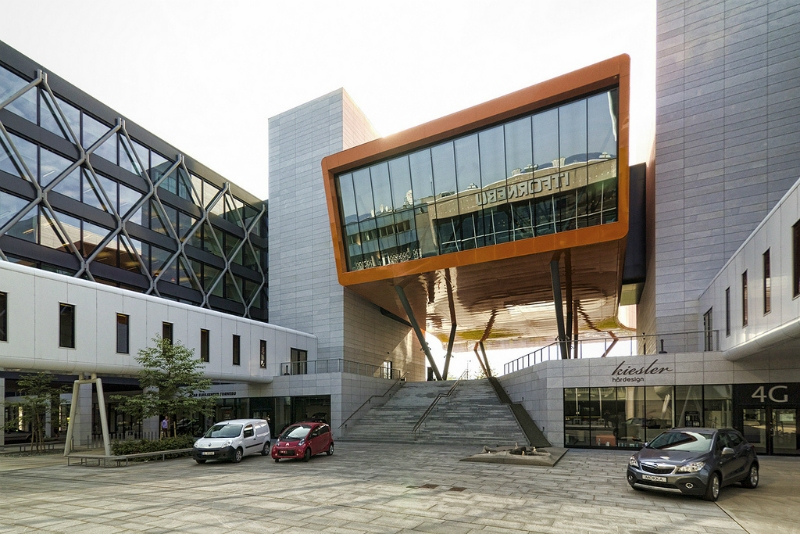

---?image=assets/bg2.jpg&size=100% auto

### Simula  

*Gabrielle Aguilar & Jason Bacani*

---?image=assets/bg2.jpg&size=100% auto

### SIMULA I

+++

#### Kristen Nygaard


+++

#### Kristen Nygaard

- Norwegian computer scientist |
- Born on August 27, 1926 Oslo, Norway |
- University of Oslo (MS in Mathematics) |
- Acknowledged as co-inventor of Object-Oriented Programming |

+++

#### Problem

- 1950s: Describing how a system works was usually done using flow diagrams and a list of rules. |
- 1957: Nygaard wanted a better way of doing this. |
- Nygaard saw the potential with computer-aided simulations |
- He wanted to standardize the procedures of simulating a system using a computer language. |
- However, he needed someone more skilled in programming.. |

+++

#### Ole-Johan Dahl


+++

#### Ole-Johan Dahl

- Norwegian computer scientist |
- Born on October 12, 1931 Mandal, Norway |
- University of Oslo (MS in Numerical Mathematics) |
- Acknowledged as co-inventor of Object-Oriented Programming |

+++

#### Birth of SIMULA I

- Nygaard and Dahl met at the Norwegian Defense Research Establishment (NDRE) |
- January 1962: Dahl joined Nygaard in developing this computer language at the NCC (Norwegian Computing Center) in Oslo |
- May 1962: SIMULA I was born, a simulation language |

+++

#### SIMULA I

- Simulation language |
- Used to program simulations on a computer |
- Not a general-purpose programming language |

+++?image=assets/dahl-nygaard2.jpg&size=100% auto

---?image=assets/bg2.jpg&size=100% auto

### SIMULA 67

+++

#### Transition to Generality

- Dahl and Nygaard realized they could make a general-purpose language from Simula I

> We can not just produce new special purpose languages the whole time, because they will not be widely implemented.  - Kristen Nygaard

+++

- Also, Dahl and Nygaard were influenced by the movement toward general-purpose languages at that time.
(ALGOL, PL/I)

> we have spent so much time with all these people working on general purpose languages, that I must admit we have to some extent fallen in love with the concept.. - Kristen Nygaard

+++

#### Ideas for Generality

- 1963: Dahl and Nygaard started to come up with ways to implement generality

- 1966: Concept of an object and a class were introduced by the two

- 1967: Paper about these novel concepts was presented at the IFIP(Intl. Fed. for Information Processing) conference in Oslo. This was considered the first formal declaration of SIMULA 67.

+++

#### SIMULA 67

- First object-oriented language(classes, subclasses, methods, instances)
- General-purpose
- Near complete superset of ALGOL-60

---?image=assets/bg2.jpg&size=100% auto

### Simula Tutorial

+++

#### Value Types
- Integer
- Real
- Boolean
- Character

+++

#### Reference Types
- Reference (pointer)
- Text (string)

+++

#### Value-Type and Text Declarations
- &lt;DataType&gt; &lt;VariableName&gt;;
```
Integer i;
Real r;
Boolean b;
Character c;
Text t;
```

+++

#### Object-Reference Declarations
- Ref(&lt;ClassName&gt;) &lt;VariableName&gt;;
```
Ref(ProgrammingLanguage) Simula;
```

+++

#### Value Assignment
- &lt;VariableName&gt; := &lt;Expression&gt;
```
i := 1;
r := 0.5;
b := TRUE;
c := 'A';
```

+++

#### Reference Assignment
- &lt;VariableName&gt; :- New &lt;ClassName&gt;
```
Simula :- New ProgrammingLanguage;
```

+++

#### Comments
- !{&lt;Character&gt;};
  - `! this is a comment;`

+++

#### Input/Output
Data Type | Input |	Output
----------|-------|-------
Integer	| I := inint; |	outint(I, 10);
Real | X := inreal; | outreal(X, 2.10);
Character	| C := inchar; | outchar(C);
Text | <ul><li>T := intext(20);</li><li>inimage;</li></ul> | <ul><li>outtext ("OK!");</li><li>outimage;</li></ul>

+++

#### Notable Operators
Operation | Symbol
----------|-------
Real Division | /
Whole Division | //
Modulus | rem(dividend, divisor)
Exponentiation | **
Concatination | &amp;

+++

#### Notable Operators (cont'd)
Operation | Symbol
----------|-------
equality | <ul><li>=</li><li>==</li><li>eqv</li></ul>
inequality | <ul><li>&lt;&gt;</li><li>=/=</li></ul>

+++

#### Block Statement
```
BEGIN {<DECLARATION>}
  {<STATEMENT>}
END;
```

+++

#### If Statement
```
IF <CONDITION> {AND|OR <CONDITION>}
  THEN <STATEMENT>
  [ELSE <STATEMENT>];
```

+++

#### GoTo Statement
```
LABEL: {<STATEMENT>}
...
GOTO LABEL;
```

+++

#### While Statement
```
WHILE <CONDITION> DO <STATEMENT>;
```

+++

#### For Statement
```
FOR I := 1 step 1 until 100 DO ...;
FOR I := 100 step -1 until 1 DO ...;
FOR C := 'A', 'E', 'I', 'O', 'U', 'Y' DO ...;
```
@[1,2](*Initialization, incrementation, and stop condition*)
@[3](*Iteration through a list*)

+++

#### Procedures
```
...
PROCEDURE ADD (A, B, C);
  NAME C; INTEGER A, B, C;
  BEGIN
    C := A + B;
  END;
...
ADD (1, 2, SUM);
OUTINT (SUM);
```
@[2](*Declare the "ADD" procedure*)
@[3](*Parameter declarations*)
@[4-6](*Procedure block*)
@[5](*Add "A" and "B" and assign result to "C"*)
@[8](*Add 1 and 2 and store the result in "SUM"*)
@[9](*Outputs 3*)

+++

#### Functions
```
...
INTEGER PROCEDURE SUM (A, B);
  INTEGER A, B;
  SUM := A + B;
...
OUTINT (SUM (1, 2));
```
@[2](*Declare "SUM" function*)
@[3](*Parameter declarations*)
@[4](*SUM is automatically returned*)
@[6](*Outputs 3*)

+++

#### Classes
```
CLASS POINT (X, Y); REAL X, Y;
	BEGIN
	  REAL PROCEDURE DIST;  
	    BEGIN DIST := SQRT (X ** 2 + Y ** 2) END;
	END;

REF (POINT) P;
P :- NEW POINT (1.0, 3.0);
OUTREAL (PX); OUTIMAGE;
OUTREAL (PY); OUTIMAGE;
OUTREAL (P.DIST); OUTIMAGE;
```
@[1](*Declare "Point" Class with X and Y coordinates*)
@[2,5](*Class block*)
@[3-4](*Returns the distance of the point from the origin*)
@[7](*Declare a reference "P"*)
@[8](*Create a new "Point" object and assign reference to "P"*)
@[9-10](*P's "X" and "Y" fields are accessed through "PX" and "PY" respectively*)
@[11](*P's "Dist" function accessed through "P.Dist"*)


+++

#### Class Inheritence
```
POINT CLASS SEGMENT (R, THETA); REAL R, THETA;
	BEGIN
	  PROCEDURE SHIFT (DX, DY); REAL DX, DY;
  	  BEGIN
  	    X := X + DX; Y := Y + DY;
  	  END;
	END;

REF (SEGMENT) S;
S :- NEW SEGMENT (1, 3, 10, PI);
S.SHIFT (-10, + 4);
```
@[1-7](*Segments are defined by a point, a length "R" and an angle "THETA"*)
@[1,10](*Creating a new "Segment" object requires arguments for creating a new "Point"*)

---?image=assets/bg2.jpg&size=100% auto

### Legacy

+++

#### Influences


Simula 67 was one of the inspirations for Alan Kay in developing **Smalltalk**

+++


James Gosling cites Simula as a major influence in the development of **Java**

+++


Bjarne Stroustrup also acknowledges Simula 67 as an inspiration for **C++**

+++

#### Recognition

IEEE John Von Neumann Medal


> For the introduction of the concepts underlying object-oriented programming through the design and implementation of SIMULA 67

+++

ACM A.M. Turing Award


> For ideas fundamental to the emergence of object oriented programming, through their design of the programming languages Simula I and Simula 67.

+++

#### Landmarks

Simula Research Laboratory  
(Fornebu, Norway)




+++

Ole-Johan Dahl's Hus  
(University of Oslo, Norway)


+++

#### Knighthood

Commander of the Royal Norwegian Order of St. Olav  
(Circa 2000)


---?image=assets/bg2.jpg&size=100% auto

### *End*

+++

#### Sources

[http://campus.hesge.ch/daehne/2004-2005/langages/simula.htm]

[http://progopedia.com/language/simula-67/]

[http://www.simula67.info/]

[http://www.iro.umontreal.ca/~vaucher/Simula/Simula.intro.html]

[http://staff.um.edu.mt/jskl1/talk.html]
